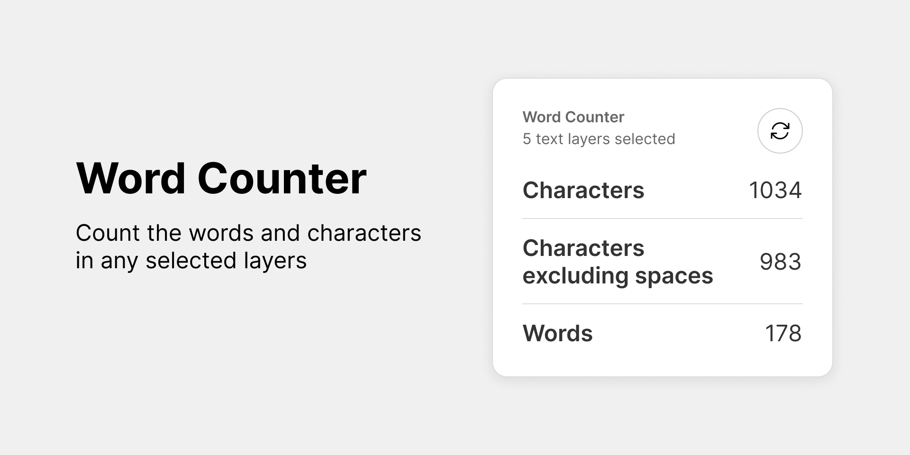

# Word Counter Widget

Figma Widget - Count the words and characters in any selected layers.

How to use this widget:

1. Drag this widget onto your Figma canvas
2. Select the widget and click the "Select layers" menu item. A popup will appear.
3. In the Figma canvas, select all the layers you want to word count
4. Click the "Use currently selected layers" button in the popup from step 2. The word counts will be update for everyone.
5. Press the refresh button at any time to recount the words of your previously selected layers.

Also, check out the [plugin version of Word Counter](https://github.com/Ligerx/figma-word-counter)

_Note: This widget does NOT automatically update as you make changes because of limitations in the Figma API. If you need this, use the plugin version of Word Counter which does support auto updates._

## Info

This repo was initialized using @figma/create-widget

ESLint and Prettier with Typescript setup with these instructions: https://blog.logrocket.com/linting-typescript-eslint-prettier

I've also included notes on my investigation of the Figma Widget API and auto updates in the [NOTES.md file](./NOTES.md)

## Getting started

Run the following command to start building your widget

```bash
npm run dev
```

1. Log in to your account and open the Figma desktop app
2. You can open any existing FigJam document or create a new one.
3. Go to Menu > Widgets > Development > "Import widget from manifest..."
4. Select the manifest.json in this folder

## Organization

This widget uses:

- [esbuild](https://esbuild.github.io/) for bundling
- [vite](https://vitejs.dev/) and [react](https://reactjs.org/) for the iframe
- [typescript](https://www.typescriptlang.org/) for typechecking

| file/folder   | description                                                                      |
| ------------- | -------------------------------------------------------------------------------- |
| manifest.json | The widget's [manifest.json](https://www.figma.com/widget-docs/widget-manifest/) |
| widget-src/   | Contains the widget code                                                         |
| ui-src/       | Contains the iframe code                                                         |

### `npm run dev`

This is the only command you need to run in development. It will start the following processes for you:

- bundling (both widget and iframe code)
- typechecking (both widget and iframe code)
- vite dev server (for iframe development)

### `npm run build`

This runs bundling with minification turned on. You should run this command before releasing your widget.

### `npm run test`

This runs typechecking and makes sure that your widget builds without errors.
